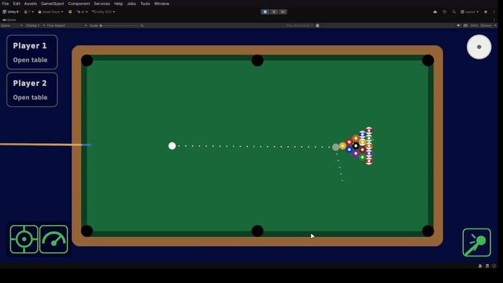
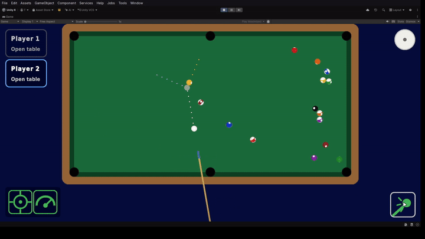

# 8 Ball Pool

A 2D top-down 8-ball pool game built in **Unity 6.5** for mobile (Android/iOS), with
pseudo-3D ball rendering, a data-driven rules engine, and dynamic camera framing.
Local pass-and-play multiplayer - two players share one device.

**▶ [Gameplay demo](https://youtu.be/SJaMDdRxtiw)**

<!-- TODO: replace with an actual screenshot/GIF of gameplay -->
<!--  -->

## Features

- **Pseudo-3D balls** - a custom shader renders flat 2D ball sprites as rotating spheres
- **Component-based rules engine** - game rules as hot-swappable MonoBehaviours, unit tested
- **Dynamic camera** - position and zoom recomputed every turn to fit the table *and* the
  space a full-power drag needs
- **Touch controls** - drag from the cue ball to set aim and power in one gesture, with
  cancel zones, lock toggles, and an explicit shoot button
- **Spin control** - top/back spin and side (English) spin, applied to both the live shot
  and the trajectory preview
- **Trajectory prediction** - a stepped physics walk showing the cue path, ghost ball,
  object-ball departure, and post-contact cue trail
- **UI Toolkit** interface with procedural art: every sprite is generated by an editor
  script, so there are almost no imported art assets

## How it works

Physics is Unity Physics 2D: the cue ball is launched by `CueController`, each ball is a
`Rigidbody2D`, and the table (felt, rails, pockets, balls, HUD widgets) is built at
runtime from the constants in `TableLayout` - ball, pocket and rail sizes all derive from
one `BallDiameter` value, so the table stays proportionally correct at any scale.

The turn loop is event-driven:

```
InputManager ── shot ──▶ CueController ──▶ physics simulates ──▶ table settles
     ▲                                                        │
     │                                              ShotRecorder (freezes facts)
     │                                                        ▼
TurnManager ◀── findings ──── RulesController ──── evaluates IShotRule components
     │                                                        ▲
     ▼                                                        │
GameplayUIController / InputManager / CameraFramer      ShotReport + GameState
```

Rules never touch the live scene: `ShotRecorder` emits one frozen `ShotReport` per shot
(who shot, what was pocketed, whether the cue scratched), rules evaluate that against a
plain `GameState`, and the controller applies the combined verdict - turn hand-over,
ball-in-hand, respots, match end.

---

## Technical highlights

### Pseudo-3D ball shader



**Problem.** The game is a 2D top-down view, so a ball is a flat circle sprite. When the
ball rolls, a static sprite makes the motion read as sliding, and spinning the sprite
around its centre looks wrong - the number patch just pirouettes. Using actual 3D sphere
meshes would drag a 3D camera, lighting and layering setup into a game whose physics,
culling and sorting are all 2D.

**Approach.** Keep everything 2D - physics, renderer, sorting - and fake the sphere in a
fragment shader (`Assets/Shaders/BallRoll.shader`). The flat `Ball_XX` sprite survives
only as the quad on the `SpriteRenderer`; the shader ignores its texture entirely.

For each pixel of the quad:

1. Reconstruct the **visible surface normal**: the quad's UV maps to `x, y` in
   `[-1, 1]`, and `z = √(1 − r²)` closes the unit length. Pixels outside the unit circle
   get an antialiased silhouette against whatever the ball sits on.
2. Rotate that direction into the **ball's own frame** with a unit quaternion (applied
   with the classic `v + 2w(q×v) + q×(q×v)` vector rotation, no matrix conversion).
3. Convert to **equirectangular map coordinates** (`atan2`/`asin`) and sample a per-ball
   surface map with the number patches. The map is uniform in longitude away from the
   patches, so the `atan2` seam is invisible.
4. Apply cheap "headlight" shading (`0.65 + 0.35·n.z`) so the disc reads as a lit sphere.

**C# ↔ shader sync.** `BallRoll` (added to every ball by `TableSetup`) owns the ball's 3D
orientation and integrates it in `FixedUpdate`:

- **Rolling**: angular velocity `ω = (ẑ × v) / r` straight from the rigidbody's velocity -
  one radian of turn per radius of travel, exactly like a ball rolling on cloth.
- **Side spin**: the cue ball additionally pivots about the vertical axis at a rate
  proportional to its side spin, matching the curve the spin model applies to velocity.

The rigidbody's own rotation is frozen (`freezeRotation`) so collision impulses never
spin the flat sprite on top of the fake sphere - this component owns all rotation.

The quaternion reaches the shader as the orientation's **conjugate** via a
`MaterialPropertyBlock` against one shared material - 16 balls, one draw batch, no
per-ball material instances.

**Result.** Balls read as real rolling objects - number patches travel over the surface,
break clusters shuffle visibly - while the runtime stays a pure 2D scene.

### Data-driven rules engine

**Problem.** 8-ball rules (group assignment, turn continuation, scratch fouls, the
8-ball's win/loss conditions) are easy to hard-code as one big `if`-ladder in the turn
handler - where they become untestable, order-dependent, and impossible to extend without
touching the game loop.

**Approach.** Each rule is a plain MonoBehaviour implementing one method:

```
IShotRule
 └── Evaluate(ShotReport shot, GameState state, RuleFindings findings)
```

The contract that makes composition safe:

- **Rules are read-only evaluators.** They read the frozen `ShotReport` and the
  `GameState`, and *accumulate decisions* on a `RuleFindings` struct. The
  `RulesController` applies findings in one place, so no rule can mutate match state
  directly.
- **Rule discovery is the Inspector.** `RulesController` caches
  `GetComponents<IShotRule>()` on the Table object - adding or removing a rule is adding
  or removing a component, and the enabled checkbox turns an individual rule off.
- **Order independence is explicit.** An 8 on the break is a loss (`EightBallWinRule`)
  but also a respot (`EightBallBreakRule`). The respot finding vetoes that same shot's
  match-end, so the verdict is identical whichever order the components sit in.
- **Rules are player-toggleable.** A `RuleCatalog` marks which rules have a safe "off"
  mode; the main menu's rules screen drives saved settings, applied before the rule set
  is cached.

Shipped rules: `GroupAssignmentRule` (first pot after the break assigns groups),
`TurnContinuationRule` (own-group pot keeps the turn; scratch hands the opponent ball in
hand), `EightBallBreakRule` (8 on break respotted) and `EightBallWinRule` (8 after
clearing your group wins; early 8 or scratch-with-8 loses).

`RulesController` also owns ball-in-hand placement - legality checks (on felt, clear of
balls and pockets) and commit flow - because restoring the cue ball is a rules decision,
not an input concern.

### Dynamic camera framing



**Problem.** A fixed camera is a compromise: zoom out to show the whole table and a
full-power drag has no on-screen room to pull back; zoom in for the drag and the table is
cropped. And since the cue ball moves every turn, the right frame moves with it.

**Approach.** The framing is pure math in a static class (`CameraFraming.Compute`), given
the cue ball position, the pointer's **full-power reach** (`cancelRadius + maxPull` -
how far from the ball the finger must be able to travel in any aim direction), and the
viewport aspect:

1. Take the **union of the table rectangle and the full-power disc's bounding box**
   around the cue ball.
2. Centre the view on that union.
3. Orthographic size is `max(halfHeight, halfWidth / aspect)` - fitting the union
   tightly to whatever aspect the phone has, with width dominating on narrow screens.

When the cue ball sits at the head spot, the disc dominates and the table is just in
frame; when it's mid-table, the frame relaxes to the table alone. Every case is framed
tightly - no empty margin, no crop.

`CameraFramer` recomputes the frame on every `OnTurnStarted` and after a ball-in-hand
commit (the carried ball moved the disc), tweening position and orthographic size
together over 0.4 s with a SmoothStep ease. The initial frame snaps.

---

## Testing

`Assets/Tests/Editor` holds **25 EditMode unit tests** (NUnit via the Unity Test
Framework). The rules tests fabricate `ShotReport` scenarios - break pots keep the table
open, scratch → ball in hand, early-8 loss, 8-on-break respot ordering, group-derived HUD
ball lists - and the camera tests pin the framing math (disc dominance at the head spot,
table-only framing mid-table, narrow-aspect width fitting).

Rules logic is deliberately decoupled from Unity APIs so it runs in EditMode without a
scene: rules receive plain data (`ShotReport`, `GameState`), never `MonoBehaviour`
references.

## Controls

| Action | Input |
| --- | --- |
| Aim | Drag from the cue ball - angle points from the ball through your finger (pull-back style) |
| Power | Same drag: distance from the cue ball, 1:1 with the cue stick pull |
| Cancel a shot setup | Release inside the cancel zone around the ball, or along the screen edge |
| Shoot | Shoot button (bottom right), unlocks on a valid drag release |
| Spin | Spin button (top right), drag on the ball graphic |
| Lock aim / power | Toggle buttons (bottom left) |
| Ball in hand | Drag the cue ball - red over illegal spots, commits on a legal release |

## Running the project

1. Clone the repository.
2. Open it with **Unity 6000.5.10f1** (Unity 6.5).
3. Open the `Assets/Scenes/Gameplay.unity` scene and press **Play**, or start from
   `MainMenu.unity`.
4. First time: run **Tools → 8 Ball Pool → Generate Sprites** in the editor - all
   sprites are procedural and must be generated into `Assets/Resources/Sprites` once.
5. Tests: **Window → General → Test Runner → EditMode → Run All**.

## Project structure

```
Assets/
├── Scripts/
│   ├── Core/        # InputManager (aim/power/cancel zones, ball-in-hand drag)
│   ├── Gameplay/    # Ball, CueController, TableSetup/TableLayout, ShotPrediction,
│   │                # BallRoll, CameraFramer/Framing, SpinModel/CueBallSpin, Pocket...
│   ├── Rules/       # IShotRule, RulesController, the four rules, ShotReport/GameState
│   ├── UI/          # UI Toolkit controllers (main menu, gameplay HUD)
│   └── Audio/       # Simple SFX routing
├── Shaders/         # BallRoll.shader (pseudo-3D ball)
├── Editor/          # SpriteGenerator, SetupPhysicsPrefabs (procedural asset pipeline)
├── UI/              # UXML/USS for both screens
├── Tests/Editor/    # EditMode unit tests
└── Scenes/          # MainMenu, Gameplay
```

## Known limitations / future work

- Fouls other than a scratch (no-contact, wrong-ball-first) are designed as one more
  `IShotRule` each but not yet implemented
- Respotted balls can land on an occupied spot - spot conflicts are unchecked
- Head-string-only ball in hand after the break is not enforced
- Single visual theme; table felt colour and rail art are runtime constants
